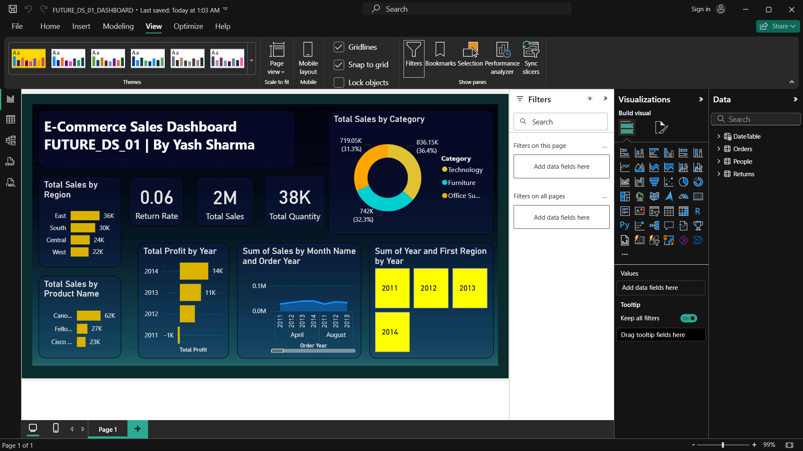

# FUTURE_DS_01_Dashboard
**E-Commerce Sales Dashboard in Power BI for Future Interns Task 1**
*Future Interns – Data Science & Analytics Internship (Task 1)*

## 📌 Project Overview  
This project is part of my Future Interns Data Science & Analytics Internship (Task 1).  
The goal was to create an **interactive and insightful Power BI dashboard** that helps analyze sales, profit, and returns for an e-commerce business.  

The dashboard not only showcases high-level KPIs but also provides the ability to drill down into trends, categories, regions, and products.  
I focused on a **professional dark theme** with clean alignment, matching colors, and smooth user interactivity.  

---

## 📂 Dataset  
The dataset used for this project is the **Sample Superstore dataset**.  
It contains historical order data including:  
- Order details (Order ID, Dates, Ship Mode)  
- Customer information (Name, Segment, Region, State)  
- Product details (Category, Sub-Category, Product Name)  
- Sales, Quantity, Discount, and Profit values  
- Additional reference tables for People and Returns  

📥 **Download Dataset:** [Click Here](superstore.xlsx)

---

## 📊 Key Features  
- **KPI Cards**: Total Sales, Total Quantity, Total Profit, Average Order Value, and Return Rate  
- **Sales by Category & Region** – Donut and Bar charts for quick comparisons  
- **Monthly Sales Trend** – Line chart showing seasonal patterns  
- **Top Products by Sales** – Bar chart highlighting best-performing products  
- **Interactive Filters** – Year, Category, and Region slicers for dynamic exploration  
- **Consistent Theme** – Dark background with Yellow-Gold, Aqua, and Orange accents for a modern look  

---

## 🛠 Skills Gained  
- Data Cleaning & Transformation using **Power Query**  
- Creating Relationships & Data Modeling in Power BI  
- Writing DAX measures for KPIs and calculated metrics  
- Applying advanced formatting & professional design principles in dashboards  
- Using slicers and cross-filtering for interactive analysis  

---

## 📷 Dashboard Preview  
  

---

## 📌 Learnings & Takeaways  
Through this task, I learned the importance of **data modeling before visualization**, how to make dashboards both **insightful and visually appealing**, and how small design changes can greatly improve user experience.  
This project also strengthened my ability to create **clear, interactive, and business-friendly dashboards** in Power BI.  

---

**By Yash Sharma**
